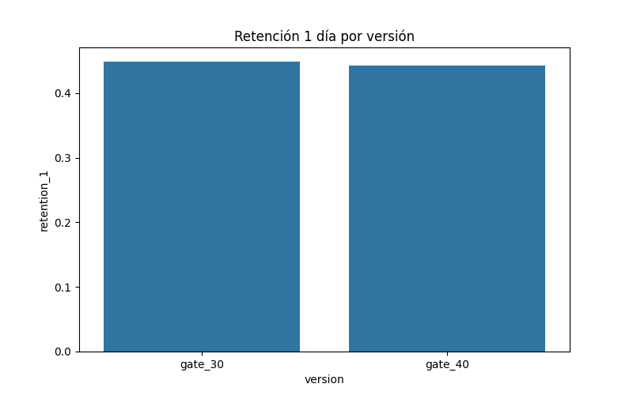
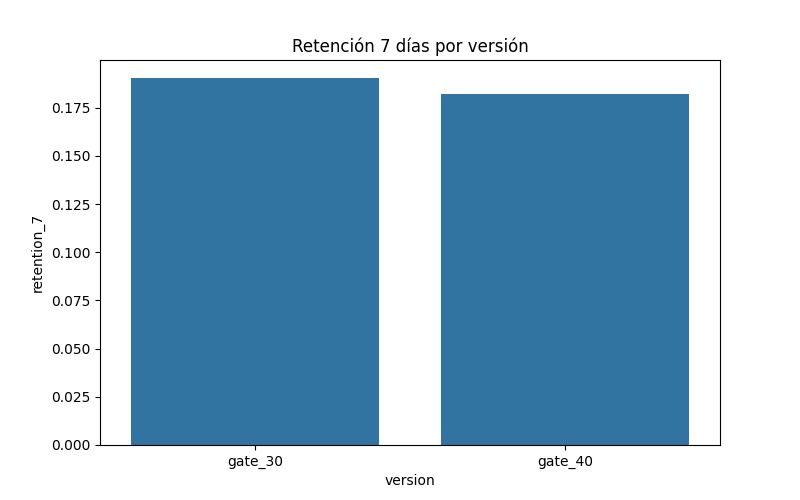
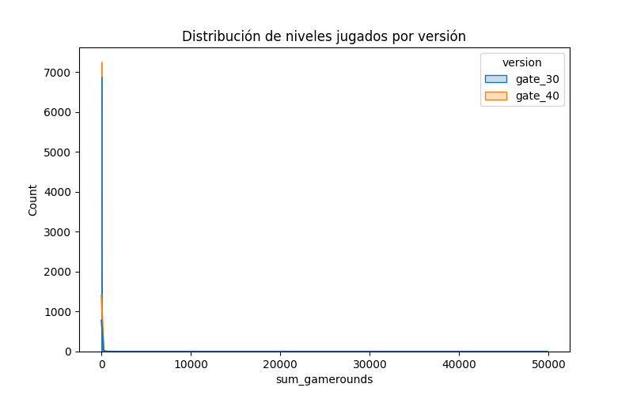

# 📊 A/B Testing Hypothesis

Este repositorio contiene el análisis A/B testing basado en el notebook de Kaggle.  
Se analiza la conversión y retención de usuarios entre grupo control y tratamiento.

## 📈 Gráficos generados

### Retención 1 día

### Retención 7 días

### Distribución de niveles jugados

## 🚀 Cómo correr el notebook

Puedes abrir y ejecutar el notebook en Google Colab:  
👉 [Abrir en Colab](https://colab.research.google.com/github/LuisBuruato/hypothesis-testing-ab/blob/main/ab_testing_hypothesis.ipynb)

---

## 📂 Estructura del repositorio
